# 🚀 DFA Minimizer & Visualizer

> A modern interactive web tool to **build, visualize, simulate, and minimize Deterministic Finite Automata (DFA)** with multiple input methods and step-by-step visualization.

---

# 🌐 Live Project URL

[(https://samson-2024ucm2352.netlify.app/)

---

# ✨ Features

* 🔹 Define DFA using **Natural Language**
* 🔹 Build DFA using **Transition Table**
* 🔹 Generate DFA from **Regular Expressions**
* 🔹 Draw DFA using **Interactive Canvas**
* 🔹 Myhill–Nerode (Table Filling Algorithm)
* 🔹 Partition Refinement (Hopcroft Method)
* 🔹 Step-by-step DFA minimization
* 🔹 Interactive graph visualization (clean UI)
* 🔹 String Simulator (Accept / Reject)
* 🔹 Original vs Minimized DFA comparison
* 🔹 Export DFA (JSON / Graph)

---

## 📁 Project Structure

```bash
DFA-Minimizer-Visualizer/
│
├── index1.html        # UI structure
├── style1.css         # Styling (Event Horizon theme)
├── script1.js         # DFA logic + Algorithms + Rendering
│
└── README.md         # Documentation
```

---

## ▶️ How to Run the Project

### 1️⃣ Clone the Repository

```bash
git clone https://github.com/samson1106/DFA_MINIMISATIO_VISUALIZER.git
```

### 2️⃣ Open in VS Code

```bash
cd dfa-minimisation-visualizer
code .
```

### 3️⃣ Run the Project

* Open `index1.html`
* Right click → **Open with Live Server** (Recommended)
  OR
* Simply open in browser

---

# ⚙️ Input Modes (Universal DFA Builder)

Your system supports **4 powerful input methods**:

---

## 🧠 1. Define Language (AI-like Input)

Describe the language → system builds DFA automatically

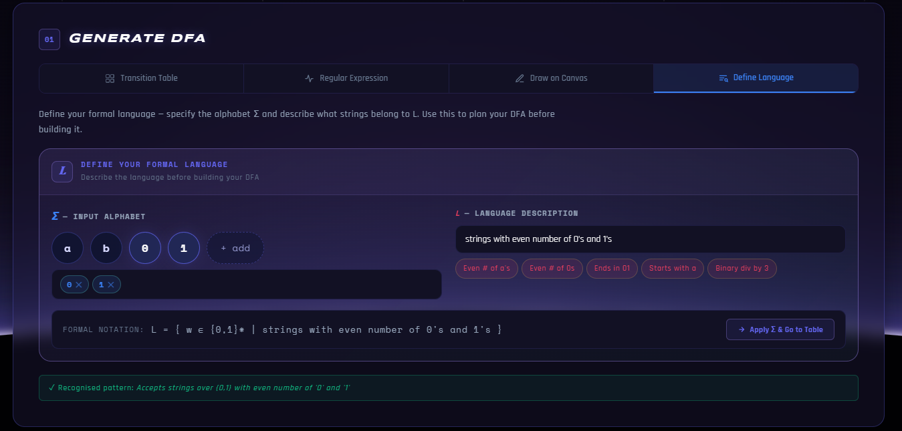

✔ Example:

* “Strings with even number of 0’s and 1’s”
* “Binary numbers divisible by 3”

---

## 🎯 2. Regular Expression Mode

Convert regex → DFA automatically

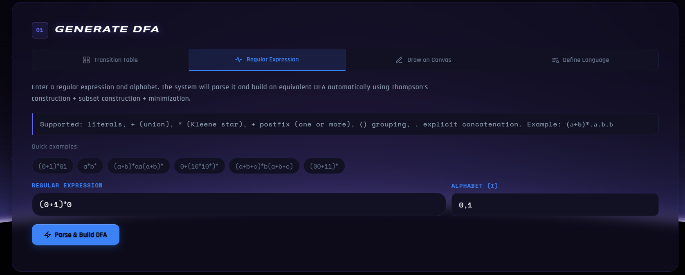

✔ Supported:

* `+` → Union
* `*` → Kleene Star
* `()` → Grouping

✔ Example:

```
(0+1)*01
```

---

## 🎨 3. Draw on Canvas

Visually create DFA

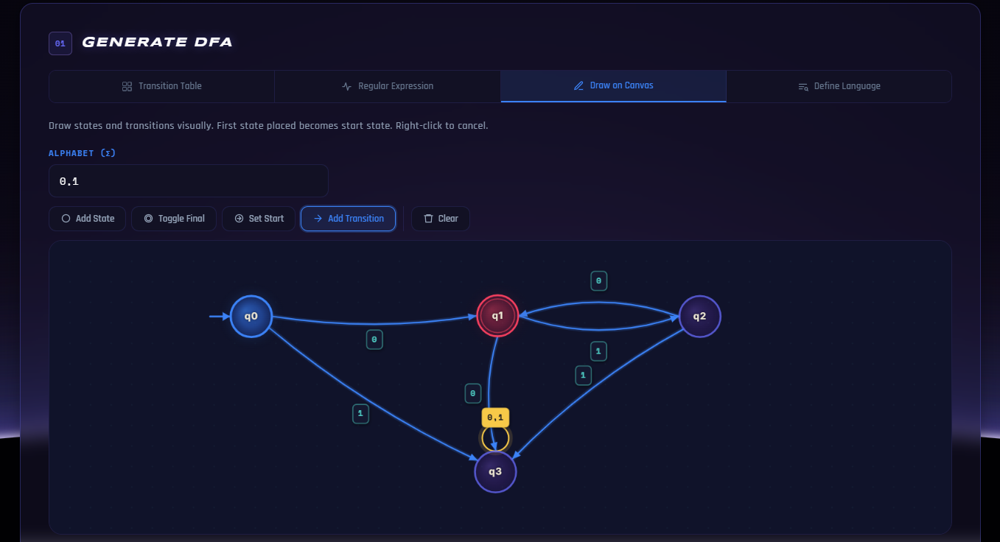

### Features:

* Add states
* Mark final states
* Draw transitions
* Auto detect start state

---

## 📊 4. Transition Table Mode

Manual DFA definition

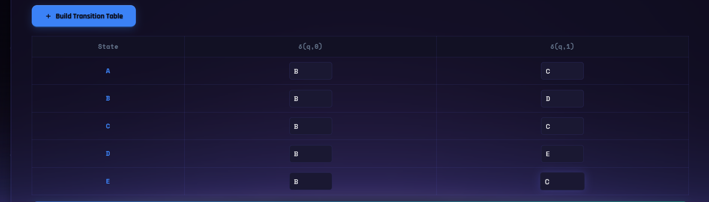

### Steps:

* Enter states, alphabet
* Define start & final states
* Fill transitions

---

# ▶️ Step-by-Step Usage

---

## Step 1️⃣ Choose Input Method

Select any of the 4 modes

---

## Step 2️⃣ Provide Input

Example (Transition Table):

* States: A, B, C, D, E
* Alphabet: 0, 1
* Start: A
* Final: E

---

## Step 3️⃣ Generate DFA

System builds:

* DFA Graph
* Transition Table

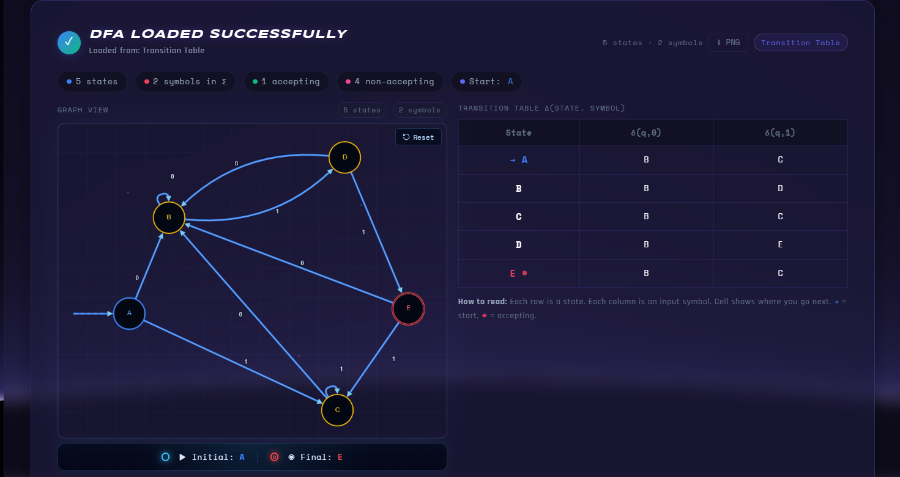

---

## Step 4️⃣ Choose Minimization Method

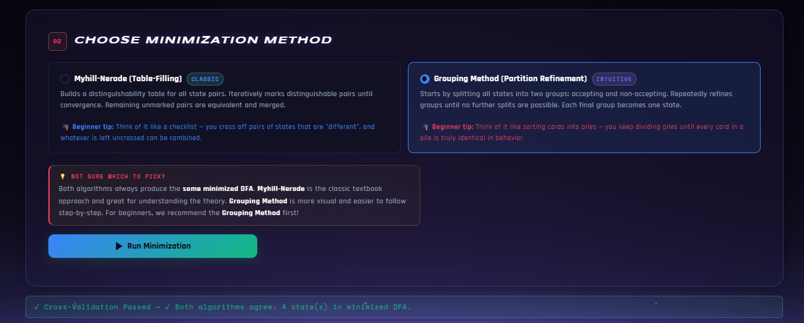

### Options:

### 🔹 Myhill–Nerode (Table Filling)

* Pairwise state comparison
* Mark distinguishable states
* Merge equivalent ones

### 🔹 Partition Refinement (Hopcroft)

* Split into final / non-final
* Refine partitions iteratively
* Highly efficient

---

## Step 5️⃣ Run Minimization

Click **Run Minimization** and click **Next Button** to see step-by-step minimisation process.


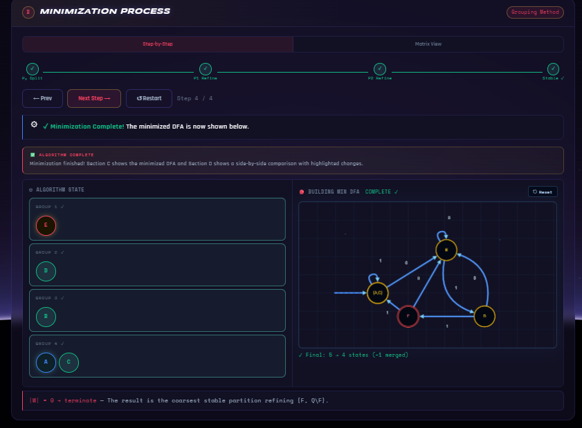

✔ System shows **Partition Refinement** :

* Step-by-step refinement
* State grouping
* Graph building


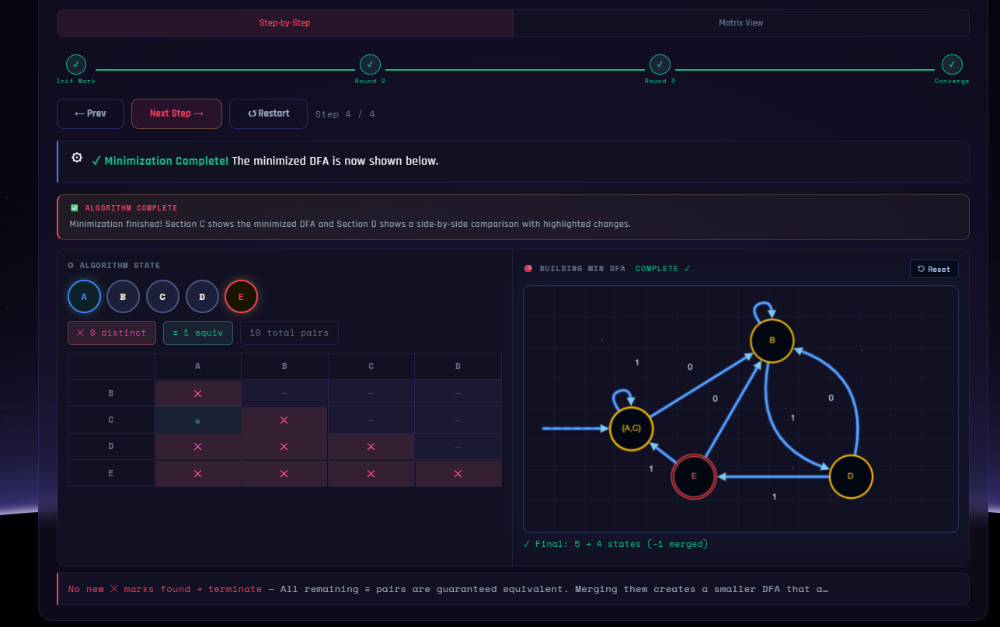

✔ System shows **Myhill–Nerode**:

* Step-by-step pairwise state comparison
*  Mark distinguishable states and merge equivalent states
* Graph building
---

## Step 6️⃣ View Results

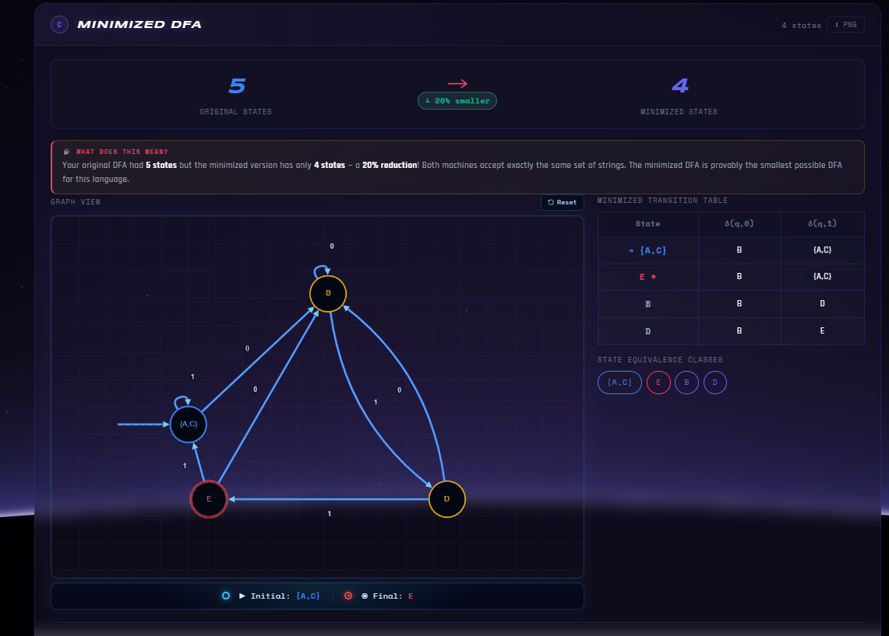

You get:

* Original DFA
* Minimized DFA
* State reductions

---

## Step 7️⃣ Side-by-Side Comparison

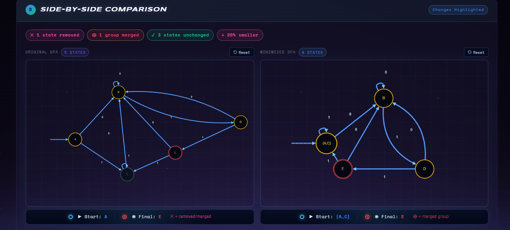

✔ Highlights:

* Merged states
* Removed states
* Size reduction

---

## Step 8️⃣ String Simulator

Test DFA behavior

### Example:

✔ Input_1: `011` → ✅ ACCEPT

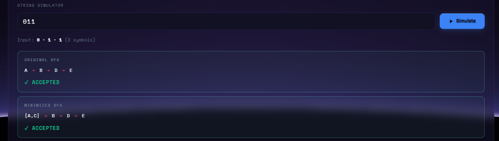


✔ Input_2: `001` → ❌ REJECT

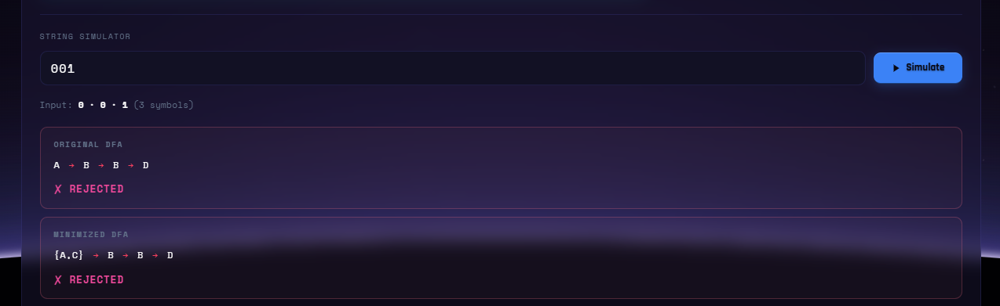

---

## Step 9️⃣ State Change Analysis

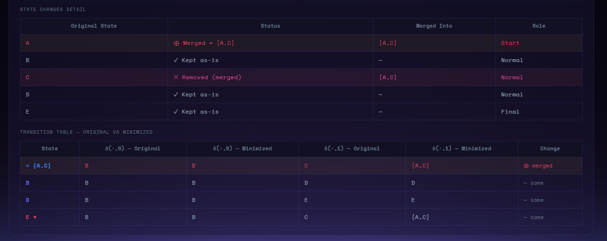

✔ Shows:

* Which states merged
* Final structure
* Transition updates

---

## Step 🔟 Export Options


✔ Download:

* JSON
* Graph
* Minimized DFA

---

# 🧠 Algorithms Explained

## 🔹 Myhill–Nerode (Table Filling)

* Create state pair table
* Mark (Final, Non-final) pairs
* Propagate distinctions
* Merge unmarked pairs

---

## 🔹 Partition Refinement (Hopcroft)

* Start with:

  * Final states
  * Non-final states
* Split groups using transitions
* Continue until stable

✔ Time Complexity: **O(n log n)**

---

# 🎯 Key Highlights

* 🔥 Clean “Event Horizon” UI
* ⚡ High-performance DFA minimization
* 🧠 Supports ALL input formats
* 🎨 Stunning graph visualization
* 📊 Fully interactive system

---

---

# 👨‍💻 Author

**Samson Barla (2024UCM2352)**

